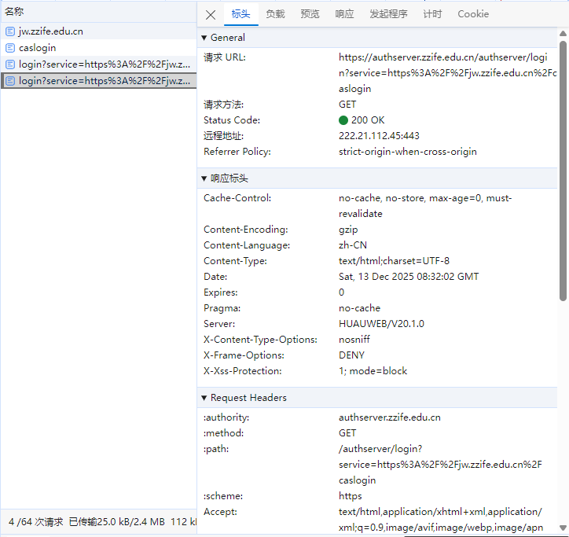
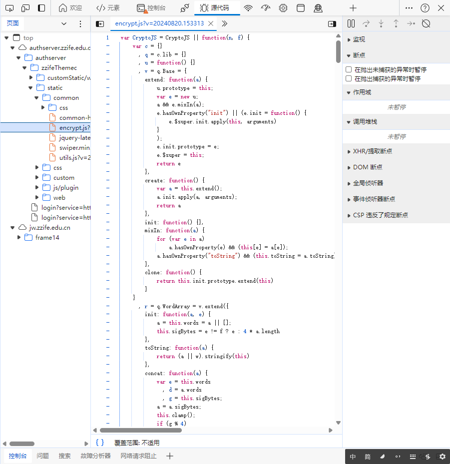
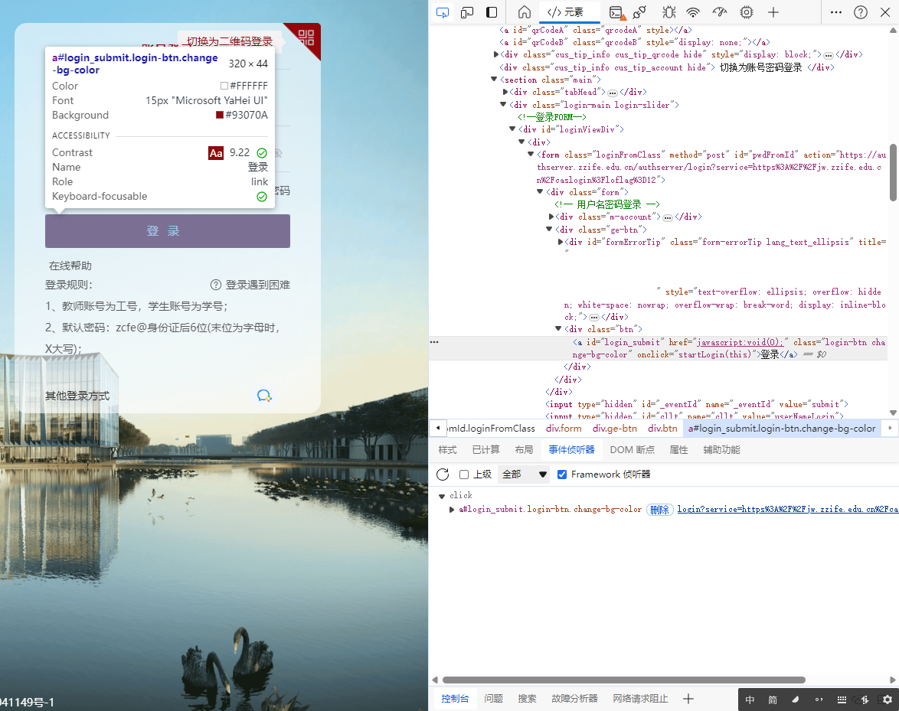
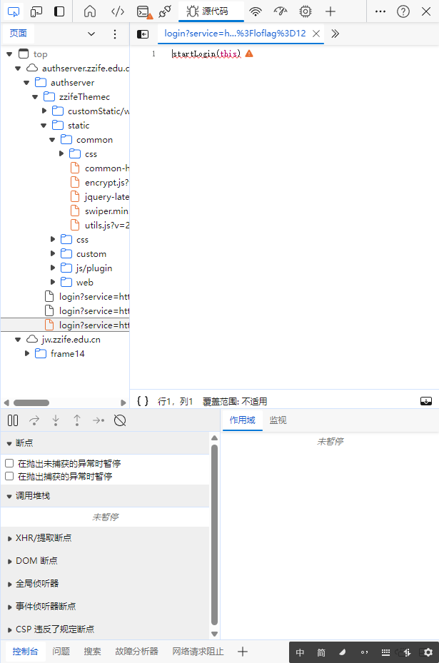

# 前言

2024年，学校舍弃了使用多年的2018版方正教务系统，改用青果教务系统，该系统使用单点登陆实现单次登录使用教务系统多个功能，最初学校并未整合校内资源平台，故教务系统使用的是青果原版单点登陆。该系统的登陆以及教务系统操作可见[仓库](https://gitee.com/WWR650/ZZIFE_Kingo_tool/tree/%E6%97%A7%E5%8D%95%E7%82%B9%E7%99%BB%E9%99%86/)

2025年上半年，学校整合校内资源平台，所有功能统一接入学校单点登陆系统，教务系统也不例外，该文章以登陆教务系统，进行一次单点登陆实操。

网上原理已十分完善，该文章不再讲述，只记录实操过程。

# 准备

## 需要的软件

- 浏览器
- Python
- idea

# 抓包分析

首先进入浏览器，打开控制台，调至网络页，正常步骤进入教务系统

可见，进入教务系统`https://jw.zzife.cn`，状态码302，重定向至`https://jw.zzife.edu.cn/caslogin`，但是该URL，状态码200，并未直接重定向
在Python中用requests get一下，可见网页直接使用js重定向至`https://authserver.zzife.edu.cn/authserver/login?service=https%3A%2F%2Fjw.zzife.edu.cn%2Fcaslogin`

跳转至校统一认证平台，但是浏览器 get 两遍，对比两次请求，可见是为了补全 cookies

当输入错误的用户名或密码，状态码401，页面回到统一认证平台；而输入正确用户名和密码，状态码302，重定向至教务系统，并且携带ticket

打开请求，可见发送的数据有`username` `password` `captcha` `_eventId` `cllt` `dllt` `lt` `execution`，对比可知`username` `password` `execution` 这三个参数是变量，`password` 为加密密码，`execution` 可在`html`源码中找到，故需get `html` 源码

# 加密解析

打开控制台，调至源代码页

可以找到密码的加密js文件，分析该文件可知，密码使用AES加密，该加密需要一个密钥，即源码内的`f`参数（也称盐值）

那么这个参数是什么呢？查看登陆按钮元素，可见点击事件会触发`login.js`里的`startlogin`函数，打上断点，跟踪事件可知，盐值为 ` html`源码内的id为`pwdEncryptSalt`的隐藏元素

# 结尾

大致流程即为此，使用python requests库session类即可完成登陆操作，需要代码可以访问[仓库](https://gitee.com/WWR650/ZZIFE_Kingo_tool)

